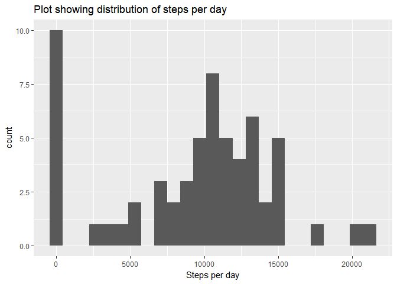
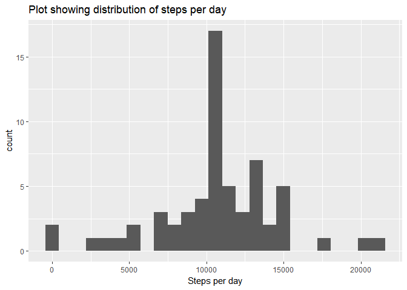
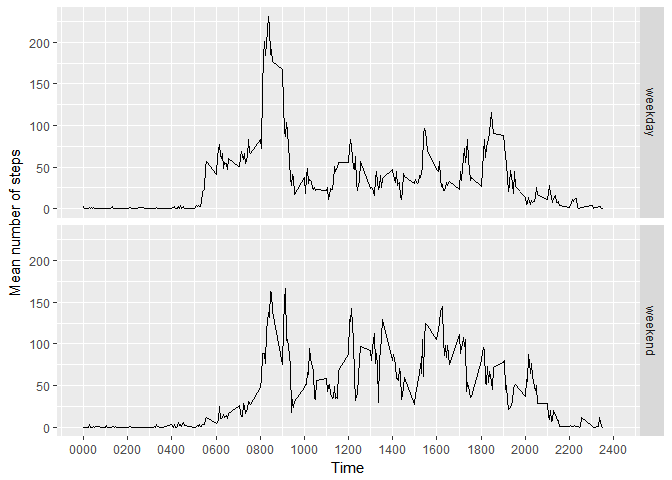

# Reproducible Research: Peer Assessment 1


## Loading and preprocessing the data
The first step is to unzip the provided file and to read it into a
data.table.


```r
unzip("activity.zip")
activity <- read.csv("activity.csv")
```

Date values need to be converted to R date tyes.


```r
activity$datex <- strptime(activity$date, "%F")
```

## What is mean total number of steps taken per day?
The data.frame will be split by date into a list of smaller data.frames which can be iterated over and values for the mean no of steps each day calculated (and placed in a new data.frame).


```r
splitactivity <- split(activity, activity$date)
sums <- numeric()
dates <- numeric()
for (i in names(splitactivity)) {
    df <- data.frame(splitactivity[i])
    names(df) <- c("steps", "date", "interval", "datex")
    sum1 <- sum(df$steps, na.rm=TRUE)
    sums <- append(sums, sum1)
    dates <- append(dates, i)
}
dfsums <- cbind(data.frame(sums), dates)
names(dfsums) <- c("sums", "dates")
```

Histogram plot of total numbers of steps taken each day:


```r
library(ggplot2)
qplot(dfsums$sums, geom="histogram", bins=25, main="Plot showing distribution of steps per day", xlab="Steps per day")
```

<!-- -->

Report of the mean and median of the sums.


```r
dfmean <- mean(dfsums$sums, na.rm=TRUE)
print(dfmean)
```

```
## [1] 9354.23
```

```r
dfmedian <- median(dfsums$sums, na.rm=TRUE)
print(dfmedian)
```

```
## [1] 10395
```

Mean is 9354.2295082, median is 1.0395\times 10^{4}

## What is the average daily activity pattern?
The table is split by interval, producing a list of data frames with the information for that interval.


```r
intervalsplit <- split(activity, activity$interval)
means <- numeric()
intervals <- numeric()
for (i in names(intervalsplit)) {
    df <- data.frame(intervalsplit[i])
    names(df) <- c("steps", "date", "interval")
    mean1 <- mean(df$steps, na.rm=TRUE)
    means <- append(means, mean1)
    intervals <- append(intervals, i)
}
meandf <- cbind(data.frame(means), intervals)
names(meandf) <- c("mean", "interval")
meandf$intervalnum <- as.numeric(as.character(meandf$interval))
```

Plot a line plot based on the above vectors.

```r
p <- ggplot(data=meandf, aes(x=intervalnum, y=mean, group=1))
p <- p + geom_line() + scale_x_continuous(breaks=seq(0, 2400, 200), limits = c(0, 2400), labels=c("0000", "0200", "0400", "0600", "0800", "1000", "1200", "1400", "1600", "1800", "2000", "2200", "2400"))
p <- p+ labs(x="Time", y="Mean number of steps")
print(p)
```

<!-- -->

Calculate which interval has the maximum number of average steps.


```r
maxint <- meandf[which.max(meandf$mean),]$interval
```

Indicating that the maximum interval is 0835.

## Imputing missing values

Number of missing values found sing is.na:


```r
ismissing <- is.na(activity$steps)
missing <- sum(ismissing)
```

Number of missing values is 2304.

The missing values imputed by using the average for that interval.


```r
#meandf     ismissing
newactivity <- cbind(activity)
for (i in 1:nrow(newactivity)){
    row <- newactivity[i,]
    if (is.na(row$steps)){
        intervalrow <- meandf[which(meandf$interval == row$interval),]
        intmean <- intervalrow$mean
        newactivity[i,]$steps <- intmean 
    }
}
library(knitr)
kable(newactivity[1:10,])
```

     steps  date          interval  datex      
----------  -----------  ---------  -----------
 1.7169811  2012-10-01           0  2012-10-01 
 0.3396226  2012-10-01           5  2012-10-01 
 0.1320755  2012-10-01          10  2012-10-01 
 0.1509434  2012-10-01          15  2012-10-01 
 0.0754717  2012-10-01          20  2012-10-01 
 2.0943396  2012-10-01          25  2012-10-01 
 0.5283019  2012-10-01          30  2012-10-01 
 0.8679245  2012-10-01          35  2012-10-01 
 0.0000000  2012-10-01          40  2012-10-01 
 1.4716981  2012-10-01          45  2012-10-01 

A histogram showing the daily number of steps taken using the imputed data.


```r
splitnewactivity <- split(newactivity, newactivity$date)
impsums <- numeric()
impdates <- numeric()
for (i in names(splitnewactivity)) {
    df <- data.frame(splitnewactivity[i])
    names(df) <- c("steps", "date", "interval")
    sum1 <- sum(df$steps, na.rm=TRUE)
    impsums <- append(impsums, sum1)
    impdates <- append(impdates, i)
}
dfimpsums <- cbind(data.frame(impsums), impdates)
names(dfimpsums) <- c("sums", "dates")

qplot(dfimpsums$sums, geom="histogram", bins=25, main="Plot showing distribution of steps per day", xlab="Steps per day")
```

<!-- -->


```r
impmean <- mean(dfimpsums$sums)
impmedian <- median(dfimpsums$sums)
```

The mean of this data was 1.0766189\times 10^{4} and the median was 1.0766189\times 10^{4}.  This compares to 9354.2295082 and 1.0395\times 10^{4} for the data including missing values.  These values are not significantly different from one another showing that the impact of imputing the missing values was minimal.

## Are there differences in activity patterns between weekdays and weekends?

The first task is to add an R date field to the imputed dataset.


```r
newactivity$datex <- strptime(activity$date, "%F")
```

The next task is to identify weekends and weekdays and encode that information in a factor column within the dataframe.


```r
newactivity$weekdayno <- newactivity$datex$wday
weekdaylog <- newactivity$weekdayno == 0  | newactivity$weekdayno == 6
newactivity$dayfac <- ifelse(weekdaylog, "weekend", "weekday")
```

Then, produing the time series of mean steps for each interval, for the newactivity dataframe.


```r
wdaysplit <- split(newactivity, newactivity$dayfac)
for (i in wdaysplit){
    df <- data.frame(i)
    dfsplit <- split(df, df$interval)
    means <- numeric()
    intervals <- numeric()
    for (j in dfsplit){
        mean1 <- mean(j$steps)
        means <- append(means, mean1)
        intervals <- append(intervals, j$interval[1])
    }
    if (i$dayfac == "weekday"){
        wdaydf <- cbind(means, intervals)
        wdaydf <- cbind(wdaydf, rep(c("weekday"), times = length(intervals)))
    } else {
        wenddf <- cbind(means, intervals)
        wenddf <- cbind(wenddf, rep(c("weekend"), times = length(intervals)))
    }
}
```

```
## Warning in if (i$dayfac == "weekday") {: the condition has length > 1 and
## only the first element will be used

## Warning in if (i$dayfac == "weekday") {: the condition has length > 1 and
## only the first element will be used
```

```r
combdf <- rbind(wdaydf, wenddf)
combdf <- data.frame(combdf)
colnames(combdf) <- c("mean", "interval", "partofweek")
combdf$mean <- as.numeric(as.character(combdf$mean))
```

Next, a panel plot comparing the weekends and weekdays activity patterns.


```r
p <- ggplot(data=combdf, aes(x=as.numeric(as.character(interval)), y=mean, group=1))
p <- p + facet_grid(partofweek~.)
p <- p + geom_line() + scale_x_continuous(breaks=seq(0, 2400, 200), limits = c(0, 2400), labels=c("0000", "0200", "0400", "0600", "0800", "1000", "1200", "1400", "1600", "1800", "2000", "2200", "2400"))
p <- p+ labs(x="Time", y="Mean number of steps")

print(p)
```

<!-- -->
